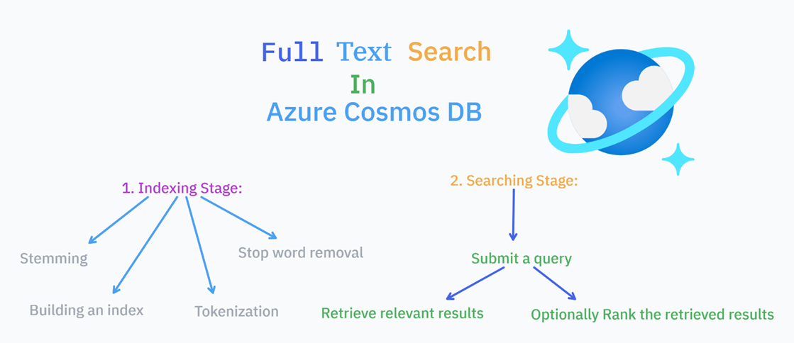

# Legal Document Search API with Azure Cosmos DB Full-Text Search

## Description

This project demonstrates building a legal document search API using Nest.js integrated with Azure Cosmos DB's full-text search capabilities. It showcases how to implement intelligent document retrieval using BM25 scoring for relevance ranking.

## What is full-text search?

Full-text search is a technique that finds specific information within a large corpus of text. It goes beyond keyword matching and analyzes the content of documents to identify relevant results based on the user’s search query. 
Azure Cosmos DB for NoSQL now offers a powerful Full Text Search feature in preview, designed to enhance the search capabilities of your applications. Read more about it here.
How does full-text search work?
A full-text search involves two primary stages:
- **Indexing**: The process of creating an index that maps terms to the documents in which they appear. This index is used to quickly locate documents that contain the search terms.
- **Searching**: The process of querying the index to retrieve relevant documents based on the search terms. The search engine ranks the documents based on their relevance to the query.
## Full-Text Search Features


- **BM25 Scoring**: Utilize advanced relevance scoring for document ranking
- **Term Frequency**: Consider how often search terms appear in documents
- **Document Length Normalization**: Account for varying document sizes
- **Inverse Document Frequency**: Weight terms based on their uniqueness

## Search Implementation

### Search Configuration
Required setup includes:
- Full-text indexing on text fields
- BM25 scoring configuration
- Query analyzers for text processing
- Composite indexes for efficient filtering

### Setup Requirements
1. Enable full-text search in Azure Cosmos DB
2. Configure text indexing policies
3. Implement search queries with BM25 scoring
4. Set up text analyzers for document processing

## Project Setup

```bash
$ pnpm install
```

## Add .env file
```bash
# API PORT
PORT=8000

# COSMOS DB
AZURE_COSMOS_DB_ENDPOINT=https://<your-endpoint>.documents.azure.com:443/
AZURE_COSMOS_DB_KEY=<your-key>
AZURE_COSMOS_DB_NAME=<your-db-name>

# AZURE OPENAI
AZURE_OPENAI_API_KEY=<your-open-ai-key>
AZURE_OPENAI_TEXT_EMBEDDING_MODEL_ENDPOINT=<your-embedding-model-endpoint>
```

## Running the Application

```bash
# development
$ pnpm run start

# watch mode
$ pnpm run start:dev

# production mode
$ pnpm run start:prod
```

## Testing

```bash
# unit tests
$ pnpm run test

# e2e tests
$ pnpm run test:e2e

# test coverage
$ pnpm run test:cov
```

## License

Nest is [MIT licensed](https://github.com/nestjs/nest/blob/master/LICENSE).
